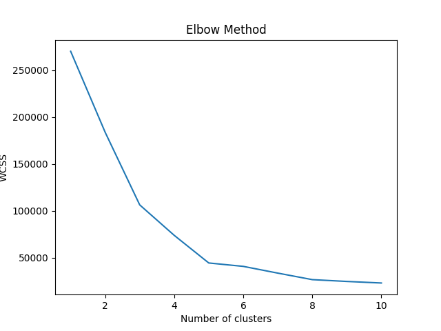
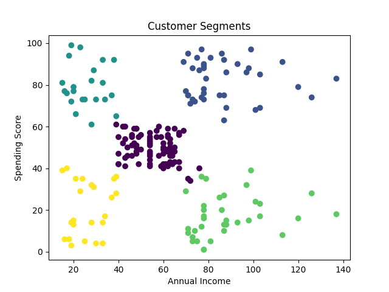

# Customer Segmentation using K-Means 📊

## 📌 Project Overview
This project segments mall customers based on their annual income and spending score using K-Means clustering.

---

## 🛠 Tools Used
- Python
- Pandas
- Matplotlib
- Scikit-learn

---

## 📊 Analysis Performed
- Data preprocessing
- Feature selection
- Elbow method to find optimal clusters
- K-Means clustering
- Cluster visualization

---

## 📈 Key Insights
- Customers are grouped into 5 segments
- High income & high spending customers are premium customers
- Low income & low spending customers are low-value customers
- Helps businesses target customers effectively

---

## 📷 Visualizations

### Elbow Method

### Customer Segments

